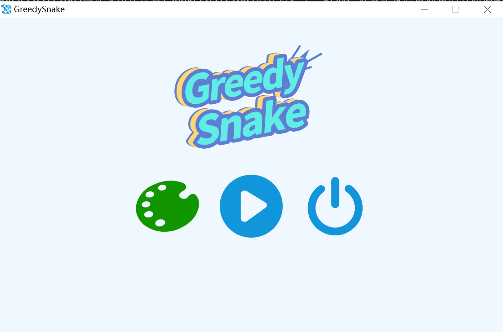
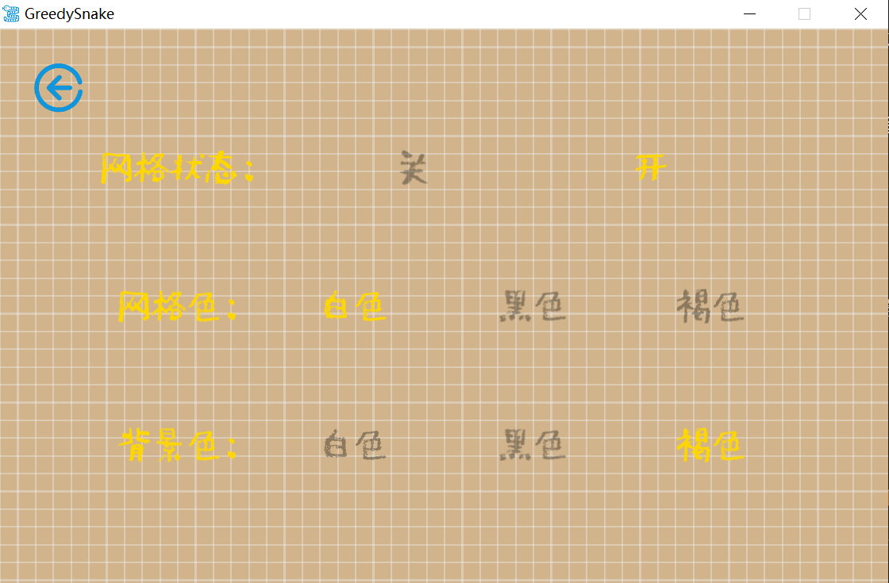
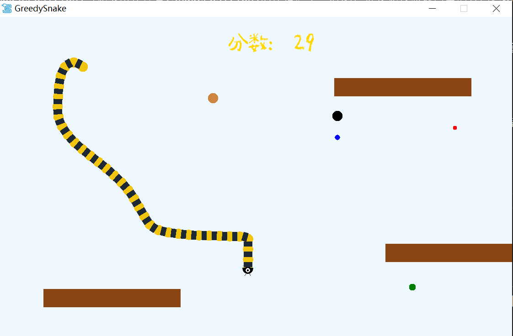

# **Greedy Snake与参考版本的差异**

**视频链接**
```
https://www.capcut.cn/share/7245235683751761204?t=1
```

**界面展示**

  

  

  

**源代码的各个函数功能和重要的实现原理均写在源代码的注释中**

## **1 贪吃蛇的控制**
- 源代码只支持4个方向的运行。
- 现除了WSAD可以控制蛇的运动之外，增加可以通过鼠标控制贪食蛇的运动当按下鼠标键时，设置一个方向向量，该方向向量为鼠标所在位置(MousePosition)与蛇头所在位置(SnakePosition)的差值。下一时刻，贪食蛇按照该向量的方向运动；运动的距离为1个标准单位
- 长按鼠标时，蛇头会随着鼠标一起移动，蛇的身体可以呈现S型
- 蛇稍稍扭头不会死，只有明显撞到自己时才会死，防止在某些情况下蛇逆行一点距离就会死的情况

## **2 水果的控制**
- 源代码只支持1种水果，颜色随机且贪食蛇增加的长度固定。
- 现增加黑色、棕色、红、蓝色、绿色、共5种水果，贪食蛇吃了黑色、棕色水果不增加其长度，红色、蓝色、绿色水果增加的长度分别为 3、2、1；增加的长度在贪食蛇的尾部——假设初始是叠加在一起的。
- 系统随机生成上述5种水果，保持黑色和褐色水果所占比例为25%，其他的占75%。
- 根据得分不同，分数越高的水果越小，也就越难以吃到

## **3 绘制精灵版本的贪吃蛇**
- 源代码中贪吃蛇的绘制过于简单——仅仅使用了矩形绘制
- 现更改贪吃蛇的绘制方法，头部使用图片，通过sprite进行绘制，其余部分使用圆叠加黑色矩形块绘制

## **4 整体界面的修改**
- 可以修改背景的颜色（提供白色、黑色、褐色三种）；
- 允许显示（或关闭显示）网格，网格的颜色可以设置（提供白色、黑色、褐色三种）
- 设置了四个页面的跳转，有按钮和选项卡，设计了logo和游戏图标

## **5 清理代码**
- 增加析构函数

## **6 增加障碍物**
- 开局随机设置3堵墙，蛇撞到墙会死
- 保证水果不会产生在和墙同一个位置而被遮挡
- 墙的位置分布均匀，不会出现两个墙重叠的情况
- 墙不会与蛇出生地重合，保证不会开局直接死
